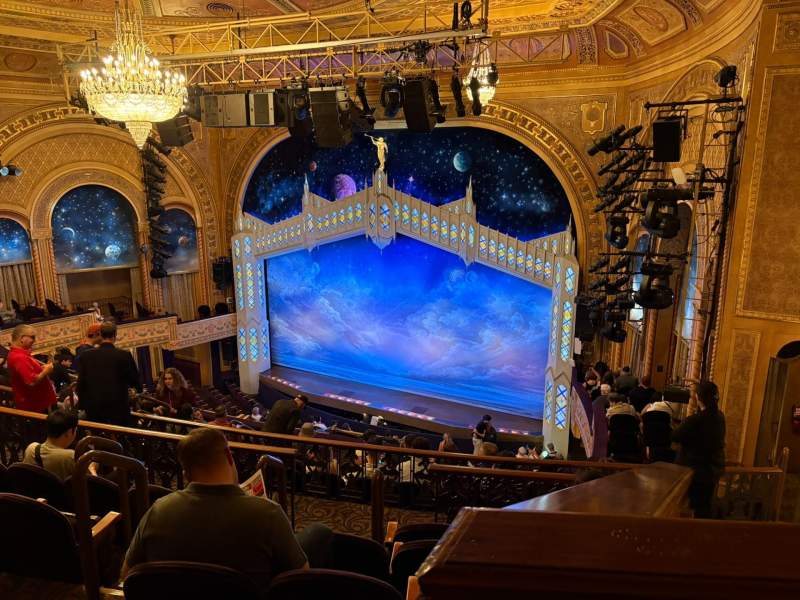
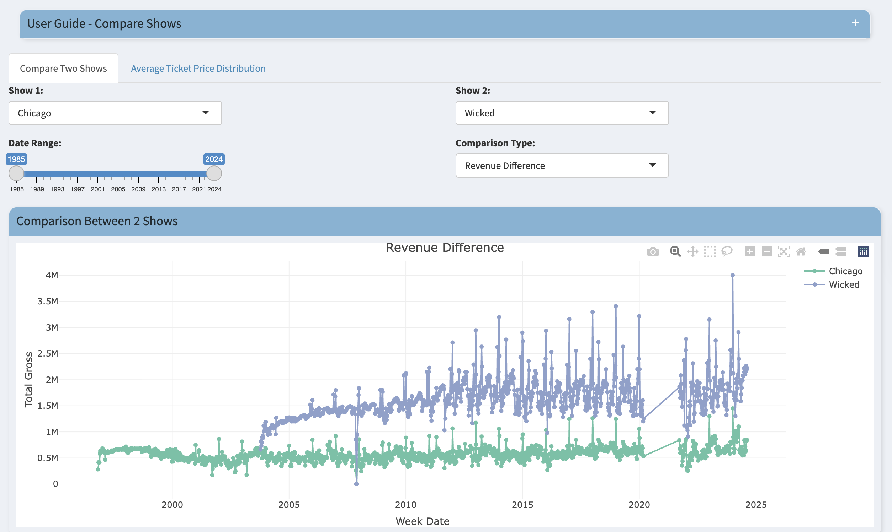
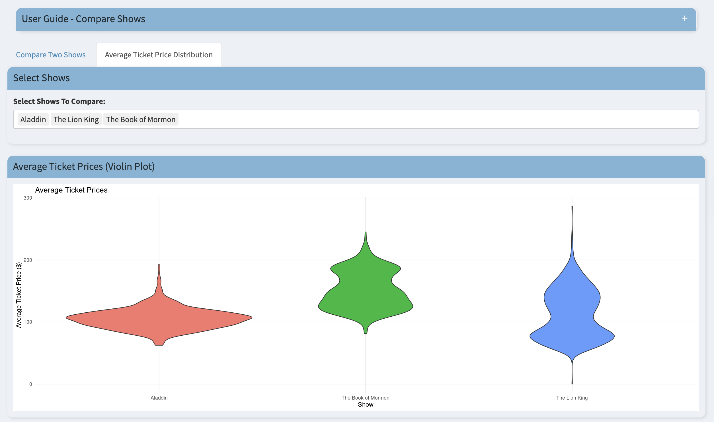
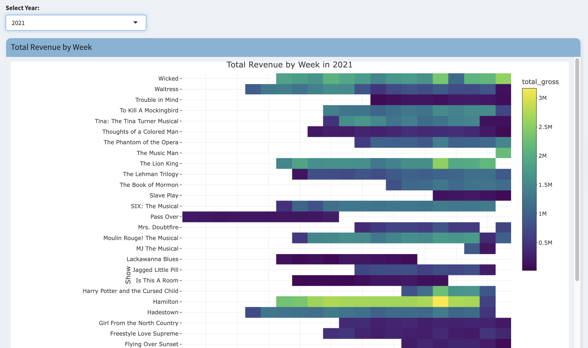
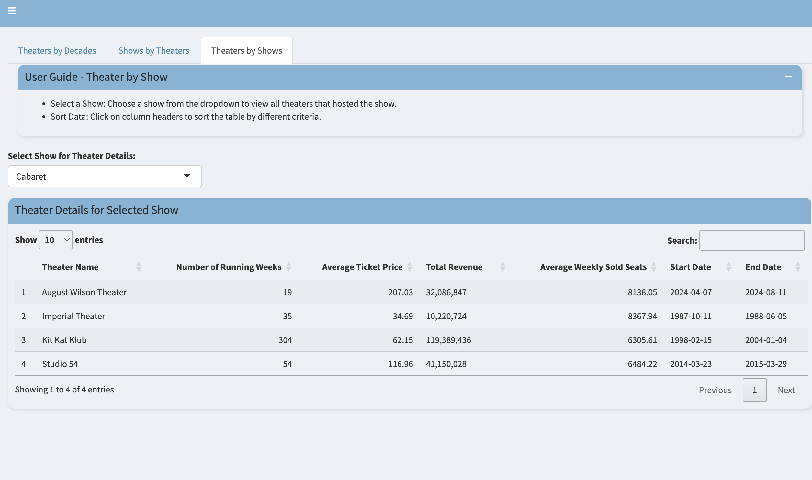

# Behind the Curtains: Insights into NYC Broadway Shows

*Generated image of a Broadway theater by DALL-E.*

---
 

<a style="padding: 10px 20px; font-size: 16px; color: #222d32; background-color: #7fb3d5; border-radius: 25px; text-decoration: none; margin-right: 10px;" href="https://chtomer.shinyapps.io/Broadway_Show_NYC/" target="_blank" rel="noopener">Broadway Shiny App</a>

&nbsp;

---

**Posted by Tomer Choresh**  
*Published on: Aug 30, 2024*

## Discovering Broadway

Until two years ago, the world of musicals and Broadway was completely foreign to me. Having spent most of my life immersed in music, particularly jazz and orchestral music, I saw anything outside of these genres as mere entertainment for the masses. This was the mindset I carried with me when I attended my first Broadway show, "Come From Away". Unfortunately, the experience was disappointing, and it reinforced my belief that live theater was overrated.

However, I soon realized that my initial disappointment came mostly from a language barrier rather than from unprofessional actors. As I started to grasp the nuances of performing live - night after night and the challenge of conveying emotions and connecting with a live audience, my perspective began to shift. I started to appreciate that, while not all the singers would rank as top musicians, they still brought energy and charisma to the roles that really made the characters come to life.

Gradually, I became more curious about Broadway. I began to distinguish between musicals and plays, dramas and productions like Shakespearean plays and wordless performances like "Illinois". I learned that the size of a theater is determined by the expected audience size and that a venue must have more than 500 seats to be considered a Broadway theater.

Before I knew it, I was hunting for affordable tickets and trying to see as many shows as possible. I even started to recognize some famous actors' names who were appearing in various productions (even though I’m usually terrible with celebrity names). In short, I found myself increasingly drawn into the world of Broadway as a captivated spectator.

*Broadway theater - view from the audience.*

---

## The Beginning - Scraping data

For several months before I started working on this project, the idea had been on my mind. The data was available on various websites, but the challenge was finding a way to consolidate it all in one place for analysis. After some thought, I realized that I would need to write a Python code to scrape the data over a few hours, extracting it into a format that I could easily work with later. I set a time limit for this task, knowing that if it didn’t work out, I would have to consider a different project.

To my surprise, the website’s structure was simpler than I had expected. Of course, there were some adjustments and tweaks needed to ensure the code ran smoothly. Yet, I was able to pull data from the present all the way back to the beginning of the dataset’s history to uncover the behind-the-scenes workings of this industry.

I began experimenting with different graphs, exploring potential linear correlations between various data points and spent a few days playing around with the data. This process eventually led me to envision how the final app would look.

As a Broadway enthusiast and a data analysis enthusiast, I wanted to see how data could reveal insights about the world of theater. To do this, I created a Shiny app that showcases how fans, investors, and producers can benefit from this data. Since the data wasn't available in a usable format, I decided to scrape it from Playbill.com. With this app, anyone can find interesting information about the shows currently playing in New York City.

---

## Data cleaning

Initially, I should have dealt with missing data and special characters that appeared in the data, such as '$', ',', and '/'. Then I began to experiment with building the app.

Working with Shiny is not always comfortable. Combining the work on three files with different roles was somewhat challenging at first. I often forgot what went where, and every time there was a small error, the app would not run at all. The process required a lot of concentration and attention to detail.

My favorite command in the app was `scales::comma()`, which allowed me to display large numbers in a more readable format (e.g., 1,000,000 instead of 1000000).

I also enhanced the original dataset by adding a summary that appears in the "Compare Show" tab. To do this, I created a loop that ran through all the shows (by name) and generated summary information in a new column. This process created a new file called `broadway_show_summaries.csv`, containing the names of the shows and their corresponding summaries. I then integrated this new column into the original data file.

---

# The App

I aimed to make the app user-friendly, allowing every user to navigate and find the information they need as easily as possible. The introduction page provides an overview of the app's content. Each tab includes explanations to help users with less technical knowledge understand the features and data presented.

---

## Introduction

The opening page includes instructions for using the app and a graph displaying total box office receipts for the industry each week. Users can select specific years to display and compare income differences. The graph also highlights the pandemic period when shows were completely halted, up until early August 2021, when Broadway theaters reopened with the show "Pass Over."

---

## Top 20 Shows

The "Top 20 Shows" page offers a quick overview of the most successful Broadway shows. It displays the most profitable shows, those with the highest weekly gross, and the longest-running shows, based on the number of weeks they have been performed.

---

## Compare

The "Compare" tab allows users to compare two shows across various parameters. This tab includes summaries for each selected show, and users can compare ticket prices and identify trends over months or years.

*Compare shows tab.*

*Violin plots to compare average ticket prices.*

---

## Yearly Heat-map

The next tab provides a yearly heat-map of total income for each show, helping users identify more profitable periods. For example, the data shows that ticket prices tend to rise significantly during the end-of-year holiday season and early January due to high demand. In contrast, ticket prices often drop by 40-60% towards the end of January and early February, likely because of lower demand after the holidays.

*Heat-map revenue tab.*

---

## Theaters

The "Theaters" tab summarizes decades of profits, the number of performances each theater has hosted, the number of seats in each theater (indicating its size), and the average ticket price sold. This information can help investors understand the implications of choosing a specific theater for different types of shows, the anticipated audience needed to fill the theater, and potentially, the production costs associated with theater size.

This tab also features two "sub-tabs." The first allows users to select a theater by name from among the 62 listed and discover which shows have been staged there. The second enables users to see when and where specific shows have been performed, making it interesting to compare the success of different shows over time.

*Theaters by show tab.*

---

## About

The final tab provides some information about me. It includes links to contact me via LinkedIn, access the code behind the app, and visit my blog, where I share other projects.

---

## Reflections and Future Additions

While developing the app, I realized that additional details would have completed the full picture. For instance, it would have been valuable to include data on genre classification for the shows and profits from merchandise sales. I also considered adding an AI feature to provide independent explanations and additional information for each play that is not currently accessible. However, due to the complexity of implementing such a feature at this time, I decided against it. I believe that in the near future, integrating such functionalities will be much simpler and will offer users more relevant, interesting, and affordable information.